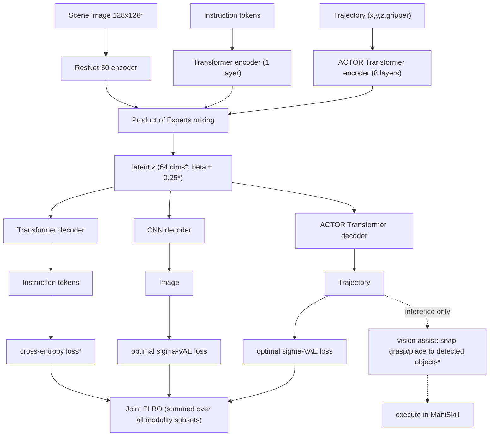
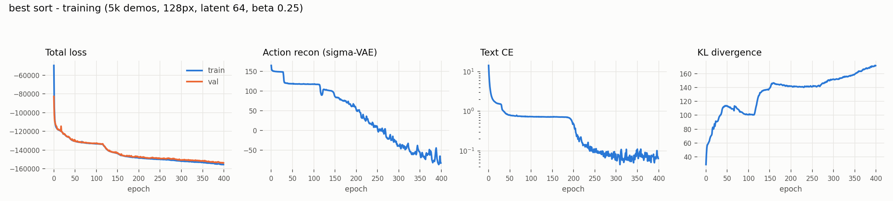

# Language-Conditioned Cube Sorting with Multimodal VAEs


https://github.com/user-attachments/assets/8805134a-5fb3-47e3-b73d-d76c7bdf253e


Reimplementation of [Bridging Language, Vision and Action: Multimodal VAEs in Robotic Manipulation Tasks](https://arxiv.org/abs/2404.01932) (Sejnova et al., 2024), adapted to the [ManiSkill 3](https://maniskill.readthedocs.io) simulator. The model learns a joint latent space over three modalities (a scene image, a language instruction, and a robot trajectory) and generates full end-effector trajectories from just an image + instruction.

The paper uses the LANRO simulator; I used ManiSkill because I used it more frequently (and lowkey because I'm from UCSD haha!). Since ManiSkill isn't language-based, instructions are generated per episode from templates ("put the red cube in the yellow box") and tokenized word-level with a small vocab.

## Architecture

Same overall design as the paper (Fig. 1): one encoder/decoder pair per modality, mixed with Product of Experts (MVAE), with each modality's reconstruction loss feeding one joint objective. Differences from the paper are marked with `*`.



At inference only the image and instruction are encoded; the trajectory is decoded from the joint posterior mean and executed open-loop as end-effector deltas.

### Changes from the paper

- **Text loss**: cross-entropy on token logits instead of reconstructing one-hots with the sigma-VAE loss (their repo does this too for language, the paper doesn't mention it).
- **Latent 64, beta 0.25** (paper: 32, beta 1). The sorting scene has 4 randomized objects, so the latent needs more capacity and less KL pressure.
- **128x128 encoder input** (paper: 64x64). The reconstruction target stays 64x64.
- **ManiSkill environment + language**: custom `SortCubes-v1` env (red + blue cube, green + yellow pad, all positions randomized) with template instructions, since ManiSkill has no language.
- **Vision assist at inference** (see eval section). Pure end-to-end gets ~2% on sorting, which matches the paper's own finding that multi-object scenes are out of scope for these models.

## Setup

```
pip install torch torchvision mani_skill scipy matplotlib
```

## Collect data

Scripted pick-and-place demos in the custom env (100% success rate, ~30 min for 5000):

```
python data/collect_sort.py --episodes 5000 --out data/sort_demos_5k.pkl
```

## Train

```
python main.py --data data/sort_demos_5k.pkl --epochs 400 --batch-size 128 \
    --latent-dim 64 --beta 0.25 --img-size 128 --amp --save best_sort.pt
```

~40 min on an A100, a few hours on a laptop GPU. Trains on all 7 modality subsets per batch (full powerset, like the reference repo) so any subset can be used at inference.



Val tracks train closely (no overfitting). The rising KL is healthy here: with beta = 0.25 the encoder packs more scene/instruction information into the latent, which is what lets the text CE drop an order of magnitude around epoch 200.

## Evaluate

```
python eval_sort.py --assist-instr
```

Tests all 4 instructions on identical scene resets, so behavior differences are purely language-driven. Reports per-instruction success (correct cube within 6 cm of correct box, distractor untouched).

| mode | success |
|---|---|
| pure end-to-end (no flag) | ~2% |
| `--assist` (model picks snap targets) | ~28% |
| `--assist-instr` (instruction picks snap targets) | **~62%** |

### How the vision assist works

The VAE gets the task structure right but its object localization blurs to ~5-10 cm, which fails 2 cm grasps. The assist fixes only that:

1. **Detection**: threshold the camera image per color, take the largest connected blob, compute its pixel centroid.
2. **Homography calibration**: over 20 random resets, pair detected pixel centroids with ground-truth object positions and fit a projective pixel -> table-xy map (one for the cube-top plane, one for the pad plane, since they sit at different heights). Mean error: ~0.2-0.6 cm.
3. **Snapping**: the model's trajectory is split at the gripper close/open events; the grasp segment is shifted so it lands on the detected cube named in the instruction, and the place segment onto the named box. Timing, z-profile, and gripper control stay 100% model-generated.

Remaining failures are mostly the arm clipping the distractor cube on approach.

## Interactive demo

```
python sort_demo.py
```

Opens the live viewer; type instructions at the prompt:

```
> put the red cube in the yellow box
  red cube -> yellow box: 0.8 cm from center (IN THE BOX)
> new
> quit
```
